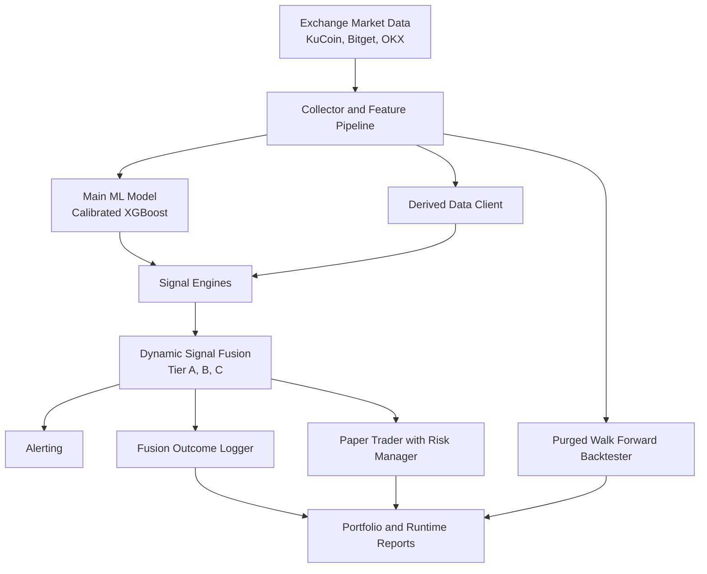

# Azalyst Crypto Intelligence

Azalyst Crypto Intelligence is an autonomous, serverless quantitative signal platform for USDT perpetual markets. It captures cross exchange microstructure, fuses machine learning with independent market engines, and emits ranked institutional style trade candidates with continuous telemetry, backtesting, and paper execution. The design objective is simple: convert noisy public crypto data into decision quality signals with clear evidence, measurable risk, and production cadence.

## The Azalyst Edge

### 1) Consensus Fusion
The system does not rely on a single probability output. It synthesizes calibrated ML probabilities, liquidation proximity, funding stress, long short positioning imbalance, perp spot basis, and open interest regime behavior into a tiered consensus framework.

### 2) Autonomous Optimization
Each cycle logs outcomes, retrains where data suffices, and evaluates strategy quality through walk forward simulation. This creates an adaptive loop where model behavior and portfolio actions are validated against realized market paths.

### 3) Execution Realism
Paper execution applies slippage, stop logic, position caps, and daily loss controls. Alerts, runtime payloads, and portfolio snapshots are persisted on every cycle so operations remain auditable.

## Core Philosophies

- **Objective Transparency**: every stage emits artifacts, including scan summaries, feature sets, fused signals, backtest reports, and portfolio states.
- **Execution Realism**: all strategy claims are tied to executable assumptions, not accuracy metrics alone.
- **Operational Autonomy**: workflows are built for unattended operation on scheduled infrastructure.
- **Resilient Data Plumbing**: exchange fallback logic prioritizes continuity under endpoint failure or partial outages.

## Architecture



## Operational Workflow

1. Scan active contracts and persist raw market state.
2. Build feature matrix and score with the main ML model.
3. Run engine stack on selected symbols.
4. Fuse model and engine outputs into consensus tiers.
5. Send alerts and execute paper entries where policy permits.
6. Log prior cycle outcomes and run backtest reports.
7. Publish runtime payloads for dashboards and monitoring.

## Key Python File Manifest

### Root
- `jobs.py`: CLI control plane for scan, train, engines, alerts, and scheduled runs.
- `scanner.py`: local loop runner for repeated scans.
- `dashboard.py`: terminal dashboard for current and historical runtime status.
- `generate_dashboard.py`: builds dashboard artifacts for publishing.
- `paper_trader.py`: portfolio lifecycle engine with slippage, stops, and webhook alerts.
- `run_institutional_scan.py`: convenience runner for institutional scan flow.
- `self_improve.py`: autonomous maintenance and improvement helper.

### Source Package: `src/`
- `src/__init__.py`: package initializer.
- `src/config.py`: runtime paths, tunables, thresholds, and environment defaults.
- `src/collector.py`: market scanner and exchange data normalization.
- `src/exchange_fallback.py`: fallback spot and perp price fetch logic.
- `src/features.py`: feature engineering and label generation.
- `src/trainer.py`: main model training and live inference.
- `src/hourly_trainer.py`: hourly pattern model training pipeline.
- `src/derived_data.py`: cross exchange enrichment and derived factor assembly.
- `src/signal_engines.py`: rule based engine stack for directional evidence.
- `src/signal_fusion.py`: weighted fusion and tier assignment.
- `src/fusion_logger.py`: previous cycle fused outcome labeling to JSONL history.
- `src/alerter.py`: Discord and Telegram alert transport with deduplication.
- `src/backtester.py`: baseline walk forward backtest implementation.
- `src/backtester_advanced.py`: advanced backtest variant retained for compatibility.
- `src/backtester_purged.py`: purged walk forward backtester with OOS metrics.
- `src/risk_engine.py`: correlation math, volatility helpers, and risk manager.
- `src/pipeline.py`: scheduled end to end orchestration entrypoint.

### Supporting Scripts
- `scripts/discord_report.py`: reporting helper for Discord summaries.
- `scratch/test_frame_injection.py`: local utility test for educational frame injection.

## Quick Start

```bash
git clone https://github.com/gitdhirajs/Azalyst-Crypto-Intelligence.git
cd Azalyst-Crypto-Intelligence
pip install -r requirements.txt
python jobs.py scheduled --show-progress
```

## Autonomous Deployment Notes

- The platform is designed for unattended scheduled execution.
- Runtime artifacts are emitted each cycle for external dashboards.
- Optional webhook integrations can be enabled through environment variables.

## Disclaimer

This repository is for research and paper simulation. It is not investment advice, and it is not a substitute for institutional risk governance.
